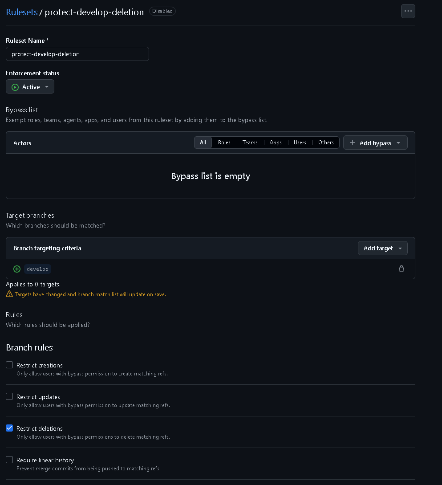

# test-repo
develop
feature

## branch ruleset
developがPR&マージされてもブランチが消えないようにする

- default branchをdevelopにしておく
- Settings->Branches->Rulesets->Add branch ruleset
から，Branch rulesの Restrict deletionsにチェックを入れてルールを作成する
- active
- `develop`をターゲットに追加

---

---

---

## settings
- Settings->Pull Requests
の，Automatically delete head branchesにはチェックを入れる(featブランチとかは消えたほうがよいだろうから)
---

---

## 2度目以降のマージ
- contributeのところを押せばよい
- マージ後に，ローカルのdevelopブランチ上で変更をして，git pull->pushできれば成功

---

---

---

---