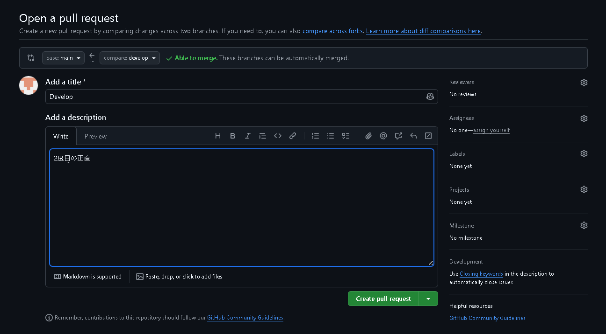
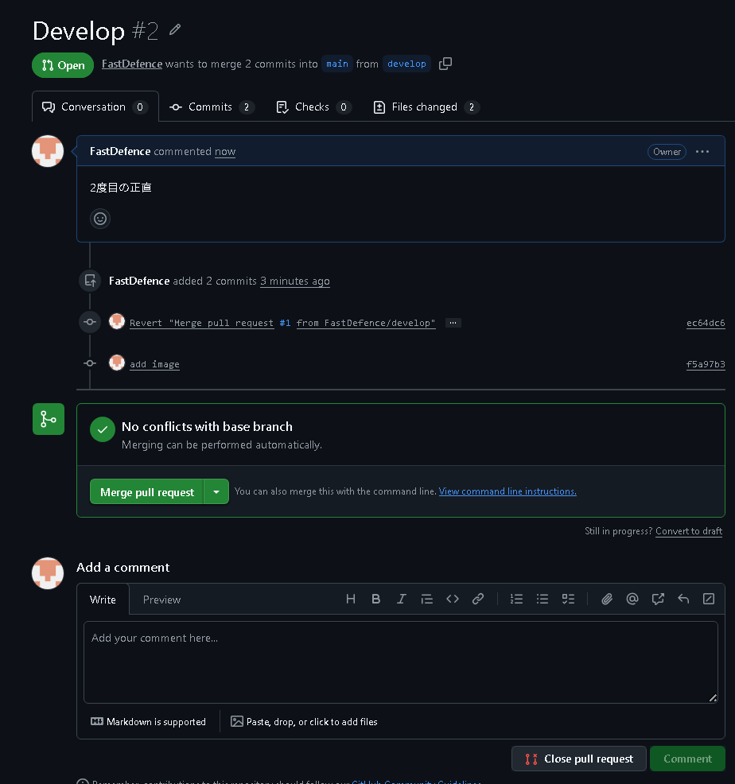

# test-repo
develop
feature

## branch ruleset
以下の条件の場合に，mainにdevelopがマージされてもブランチを消えないようにする

- default branchをdevelopにしておく

Settings->Branches->Rulesets->Add branch ruleset
から，Branch rulesの Restrict deletionsにチェックを入れる
---

---

---

## settings
Settings->Pull Requests
の，Automatically delete head branchesにはチェックを入れない
---

---

## 2度目以降のマージ
---

---

---

---

---