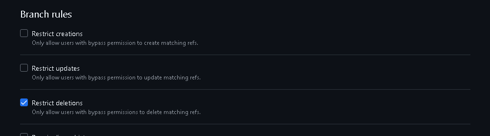
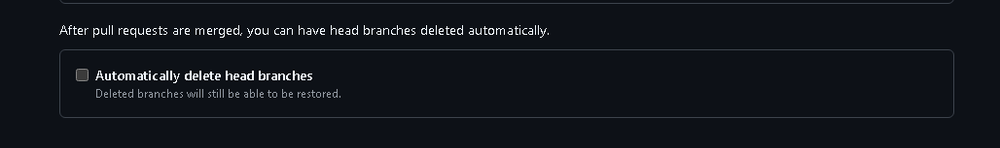
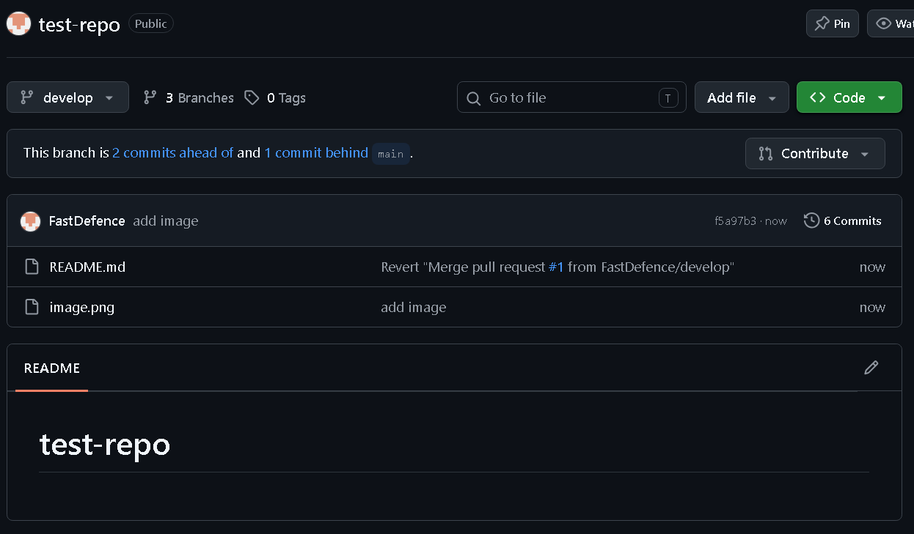
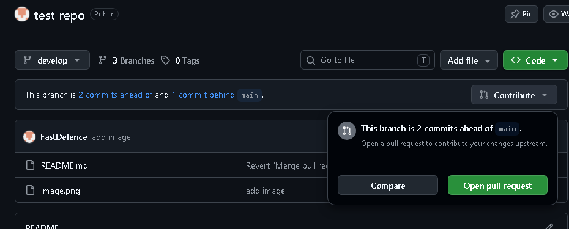
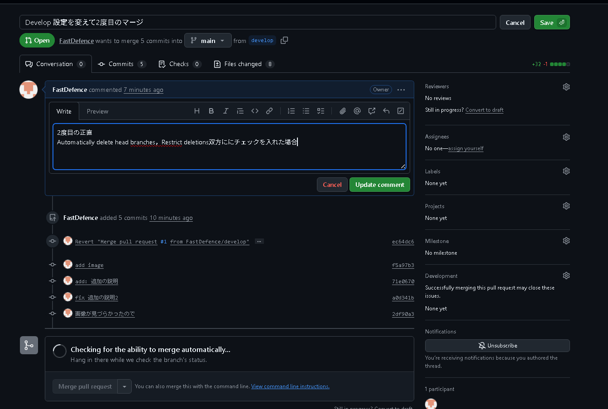

# test-repo
develop
feature

## branch ruleset
以下の条件の場合に，mainにdevelopがマージされてもブランチを消えないようにする

- default branchをdevelopにしておく

- Settings->Branches->Rulesets->Add branch ruleset
から，Branch rulesの Restrict deletionsにチェックを入れてルールを作成する
---

---

---

## settings
- Settings->Pull Requests
の，Automatically delete head branchesにはチェックを入れる(featブランチとかは消えたほうがよいだろうから)
---

---

## 2度目以降のマージ
- contributeのところを押せばよい
---

---

---

---